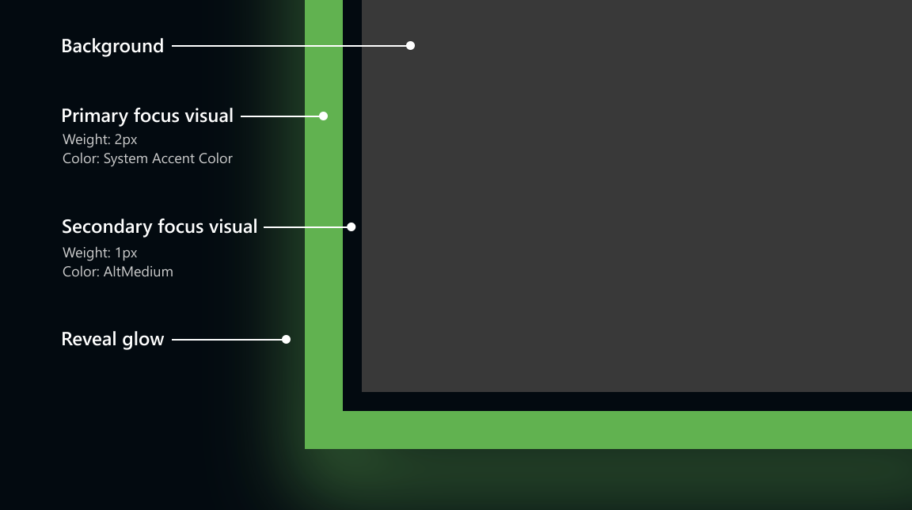

# Reveal Focus in Qt

[**Reveal Focus**](https://learn.microsoft.com/en-us/windows/uwp/ui-input/reveal-focus) is a lighting effect for 10-foot experiences, such as game consoles on television screens. It animates the border of focusable elements, such as buttons, when the user moves gamepad or keyboard focus to them.

This repository brings this beautiful effect to Qt Widget and Qt Quick. Some features are dropped to simplify the porting process (the outer reveal glow and some possible animations).

## How it works

Reveal Focus calls attention to focused elements by adding an animated glow around the element's border:

This is especially helpful in 10-foot scenarios where the user might not be paying full attention to the entire TV screen.

## Customizing Reveal Focus

There are three parts to the default Reveal Focus visuals: the primary border, the secondary border and the Reveal glow. The primary border is 2px thick, and runs around the outside of the secondary border. The secondary border is 1px thick and runs around the inside of the primary border. The Reveal Focus glow has a thickness proportional to the thickness of the primary border and runs around the outside of the primary border.

In addition to the static elements, Reveal Focus visuals feature an animated light that pulsates when at rests and moves in the direction of focus when moving focus.
